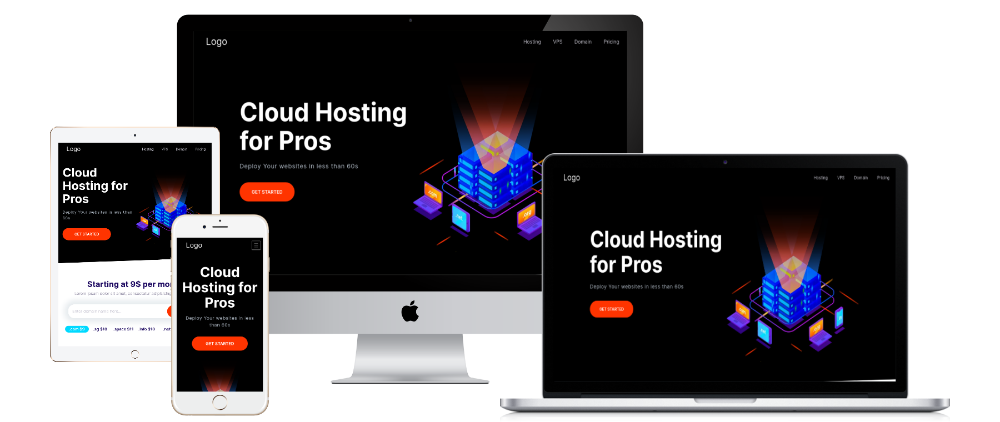

# Domains - landingpage

**Live Preview: [Here](https://html-css-training-project.netlify.app)**

Fully responsive and modern looking landingpage.

---

**Pure HTML and CSS** made as a practice project. There is only first page in the website. In this project I learned how to create modern UI, understand how is BEM methodology working and how to use class names in project. By this project I betterment also my HTML and CSS skills.   The page is divided into sections:
- Navbar,
- Hero,
- Popular products,
- Domain block,
- Plans block,
- Features block,
- Showcase block,
- Testimonials block,
- Callout block,
- Footer

All sections have comments and also are created in independent files into components folder.

## In project are used: 
- Responsive Web Design (RWD),
- Coments in index.html and styles.css to organize structure,
- One JS script to collapse items,
- Meta tags to improve SEO,

## Tools Used
1. HTML
2. CSS
3. Photoshop
4. Netlify (Deployment)
5. VSCode (Code Editor)

Deploy on Netlify free,
 
Also Thanks to Mosh Hamedani for Ultimate HTML and CSS course series!
